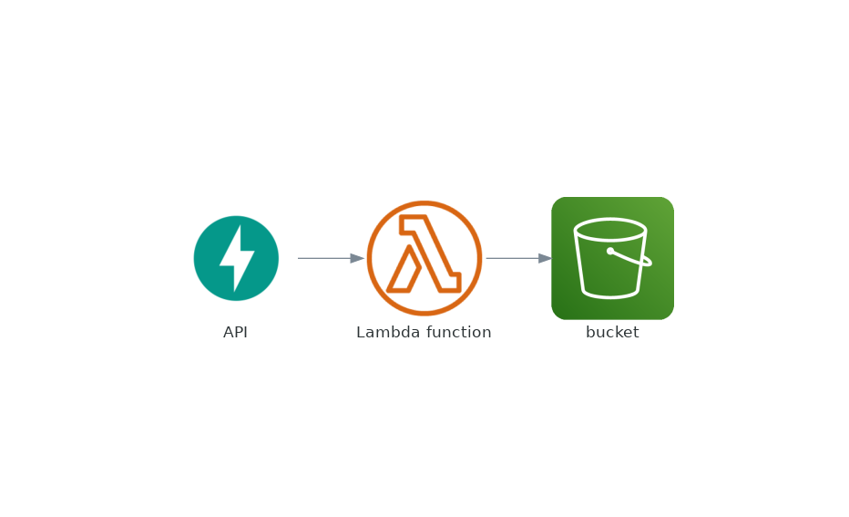

# Lambda Function Deploy

## Introduction and project overview

This project was built to practice some Data Engineering skills. First we created scripts to extract data from two different APIs. The first API is an API that returns data related to crypto coins an the second one has data related to regulated currency we have around the world.
The project was designed in an OOP paradigm and we can easilly choose the way we do the extraction. We can choose witch API we want to use, how we are calling it and where we want to save the data (locally or in the cloud). Here we have an explanation of all the files and classes referred at this project.


* scripts: the script that we can use to choose the ingestor we are using with it's parameters.

* ingestor.py: the ingestors classes. Actually has two classes, one abstract and other concrete. If we need ant other ingestor we can create another class and add it to the ingestor.py file.
    * DataIngestor: abstract class. Needs the writer, the api, the currency and the date list.
    * CurrencyIngestorByDate: concrete class, implements the ingest method.

* api.py: the API's classes. Actually has three classes, one abstract and two concretes. As in the ingestor classes, if we need another API endpoint we can create another class and add it to the api.py file.
    * ResponseApi: abstract class.
    * HistoryCurrencyApi: concrete class, implements the _get_endpoint and _adjust_response methods. API reference: "https://exchangeratesapi.io/"
    * HistoryCryptoApi: concrete class, implements the _get_endpoint and _adjust_response methods. API reference: "https://www.mercadobitcoin.com.br/"

* writers.py: the writer's classes. Actually has two classes, one two concretes, but one inherits from another. As in the previous classes, if we need another type of writer we can create another class and add it to the writers.py file.
    * DataWriter: concrete class, used to create de JSON files with the data gathered from the API locally.
    * S3Writer: concrete class, inherits from DataWriter, but overrides the writes methods. Used to create the JSON files in the cloud.

There is already two scripts that can be runned to make the API extraction, locally or in the cloud.

Finally a lambda function script was created. The script is used to extract the data from the API using cloud computation and save it into S3. This lambda function can be automatically deployed with the zappa settings configured in zappa_settings.json.




## Tecnologies and tools used
* Language: Python 3.8
* Programming paradigm: OOP
* Package Management: Poetry
* Style/Linting: Flake8/Black
* CI/CD: github actions

## How to run

Cofigure a .env file with the following variables:
```
TOKEN=<exchangeratesapi_token>
ACCESS_KEY=<AWS_access_key>
SECRET_KEY=<AWS_secret_key>
BUCKET_S3=<bucket_name_to_save_the_data>
```
Installing the packages:
```
make init
```
Running tests:
```
python -m pytest
python -m pytest --cov-report term-missing --cov=src
```
Deployng manually:
```
poetry run zappa deploy <stage>
```


## Code quality and CI/CD

To guarantee code and development quality was created automated tests using pytest and for formatting/linting was used flake8 and black.

To enforce the commits quality it was used a pre-commit package that make tests in changed files using flake8 and black. If the tests fails, the commit is rejected.

To implement CI/CD it was used github actions. It provides automatically Pull Requests and customizable templates. On pushs on develop branch, the code is deployed to the stage. On pushs on master branch, the code is deployed to production.  
